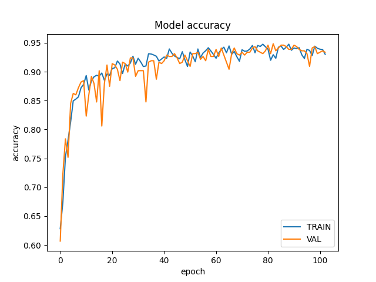

# Sitting_Pose_detection
This project is an implementation of MoveNet which is developed by Google. Inspired by monolesan's fix_posture projecte,we are going to set more thresholds and use the deep-learning method.  
## Setting thresholds  
* Use the first 30 frame collected by camera to set the average baseline of each keypoint.  
* Set the thresholds by comparing the eye position with average value and the tan() value of two eyes is limited, also the lower body is not allowed to show up.  
* Pop-up notification for wrong pose.  
* In order to reduce the error rate of the MoveNet model, we create few counters for multi-frame detection.  

## Deep-learning method (Train on your own data)
* Generate keypoints by MoveNet.
* Collect datas by camera frame(no need to take photos and label them just run the 'dataset_generater.py').
* Use the keypoints as input and the label as output to train the fully connected network.
* Test the model by the test dataset(same as step 2).
* Test the model on real-time by model you trained then cheak if there is any wrong classification.
* Add more datas(according to the wrong classification of previous step ) and retrain the model.
* 
### Dataset collecting suggestion
* Collect the data by running the 'dataset_generater.py'.
* The data will be saved in the corrent directory.
* We need to collect right and wrong pose both, when collecting the right sitting pose, you need to sit up stright and move you head slowly just like you normally use computers.
* When collecting the wrong pose, you need to think about the wrong pose you commonly do(too far or too close to the mointor, shouders,head or lower body...), we recommend that collect different wrong pose separatly(see next step).
* Run the training.py to train the model. Test the model by running the deeplearning_test.py, and comment #alarm(). If the model works well, you can run the deeplearning_test.py without comment #alarm() to test the model on real-time.
* If not, find out the wrong classification on real-time demo and add more datas to the dataset than retrain the model.  
# Notice
* The data is easy to collect and the model training is fast, so it's convenient to train the model suitable for your own device and working environment.
* We didn't collect test data due to the test is virtualized, but it's ok to do so.
* The data is collected really fast you can add a delay by frame to frame also we highly suggest that the different wrong pose can be collect separately. 

# Things on going:  
- [x] Implemente Movenet to generate keypoints  
- [x] Visualization keypoints on real-time by opencv  
- [x] Setting thresholds for classification
- [x] Dateset collecting
- [x] Build fully connected network training and testing 
The deep learning method we propose is going to lead users to set up their own model which is at the end of the MoveNet network, due to the different device and working environment.

